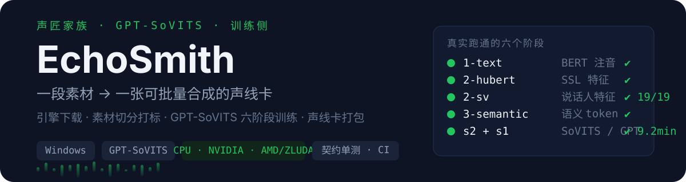
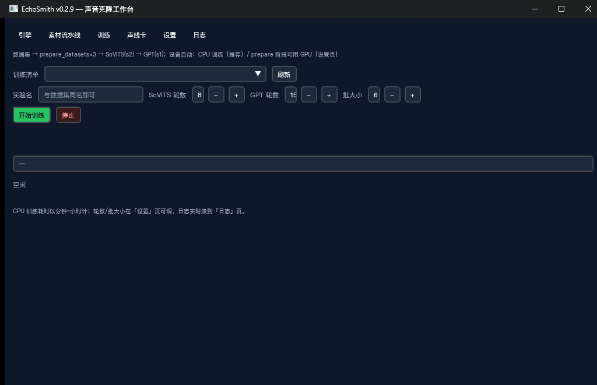
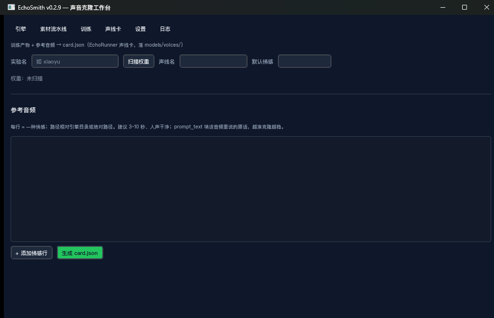
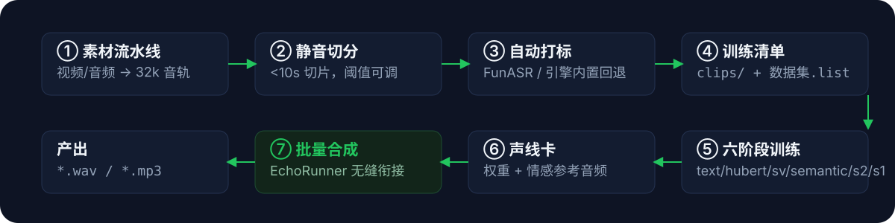

<div align="center">
  
</div>

# EchoSmith

**声匠家族 · 训练侧。** 在官方 [GPT-SoVITS](https://github.com/RVC-Boss/GPT-SoVITS) 整合包之上,把「一段音频素材」变成「一张可批量合成的声线卡」——引擎下载、素材切分打标、六阶段训练、声线卡打包,全程 GUI 编排,遇错即停。

批量合成用姊妹项目 **[EchoRunner](https://github.com/GreenChennai/EchoRunner)**(消费这里产出的声线卡)。

<div align="center">
  
  
</div>

## 它能做什么

| 模块 | 能力 |
|---|---|
| **引擎向导** | manifest 驱动下载官方整合包(HF 主源 + hf-mirror 回退、断点续传、7-Zip 解压、目录校验);也支持导入本地 `.7z` 或直接指向已解压目录 |
| **素材流水线** | 视频/音频 → ffmpeg 提 32k 单声道 → 可选 UVR5 人声分离 → 静音切分(阈值/片段长度可调,目标 <10s)→ 自动打标 → 生成 GPT-SoVITS 格式 `.list` |
| **打标** | 优先本地 FunASR 服务(MomentShift 服务模式,OpenAI 兼容);服务不可达时自动回退整合包内置 funasr 批量转写,离线可用 |
| **训练编排** | 六阶段子进程链:`1-text → 2-hubert → 2-sv → 3-semantic → s2(SoVITS) → s1(GPT)`;版本自动探测(v2ProPlus / v2Pro / v2 / v1);日志实时滚屏、遇错即停、随时可停 |
| **声线卡** | 扫描训练产物 → 绑定多套带情感标签的参考音频(3~10 秒硬校验,越界拦截)→ 产出 EchoRunner 兼容 `card.json` |
| **设备后端** | CPU / NVIDIA CUDA 原生 / **AMD 经 ZLUDA**(兼容补丁自动应用,关闭时一键还原原版 DLL) |

> 训练编排与 UVR5 走整合包内部接口,**契约已逐行对照 GPT-SoVITS 官方源码核验**(prepare_datasets 环境变量与分片合并、s2_train JSON 配置、s1_train YAML 配置、uvr5 `vr.py` 签名与产物命名、v2Pro 的 sv 阶段);引擎版本演进时错误信息原样透出,便于适配。

## 全流程

<div align="center">
  
</div>

真实跑通的记录:19 条切片的数据集,prepare 四阶段在 GPU 完成,s2+s1 训练在 CPU **9.2 分钟**跑完 1 epoch,产出的权重经声线卡打包后在 EchoRunner 以 27 秒/句合成验证。

## 快速开始

### 0. 引擎(一次性,三选一)

「引擎」页:

1. **自动下载**——选版本 → 开始下载(HF 不通自动切 hf-mirror,支持断点续传)
2. **本地导入**——已下载好的官方 `.7z`
3. **已有目录**——指向已解压的整合包根目录(需含 `api_v2.py` 与 `runtime/`)

### 1. 跑数据集

「素材流水线」页 → 选素材 → 填数据集名称 → 开始处理。
前置:本地 FunASR 服务在线(可选项,不在线会自动回退引擎内置转写)。

```
models/datasets/<名称>/
├── clips/clip_001.wav ...   # 训练片段
└── <名称>.list              # path|speaker|lang|text 标注清单
```

### 2. 训练

「训练」页 → 刷新清单 → 选 `.list` → 实验名/轮数/批大小 → 开始训练。
六阶段自动跑完,权重落在引擎 `SoVITS_weights_*` / `GPT_weights_*` 目录。

### 3. 声线卡 → 去合成

「声线卡」页 → 扫描权重 → 添加情感参考音频行(3~10 秒、人声干净,`prompt_text` 填原话)→ 生成 `card.json`。
把声线卡交给 [EchoRunner](https://github.com/GreenChennai/EchoRunner) 即可批量合成。

## AMD 显卡 GPU 加速(ZLUDA)

N 卡开箱即用(整合包 torch 为 CUDA 构建);AMD 卡经 [ZLUDA](https://github.com/lshqqytiger/ZLUDA) 转译跑同一条 CUDA 契约,**引擎脚本零手动修改**——下载/导入后与每次训练前自动应用幂等补丁(`ZLUDA_MODE` 守卫,不开 GPU 时零副作用):

- g2pw 文本前端强制走 CPU(ONNX Runtime 的 CUDA EP 在 ZLUDA 下必崩)
- 全部含卷积的引擎脚本按 **MIOpen 可用性守卫 cuDNN**:官方 HIP SDK 不带 MIOpen.dll → 自动禁用 cuDNN 走原生卷积;换 [TheRock nightly](https://therock-nightly-tarball.s3.amazonaws.com/index.html)(RDNA4 选 `gfx120X`)等 ML 构建则自动恢复
- ZLUDA 的 cuFFT 转译未实现 → fft/stft 与 CUDA 复数 abs 自动 CPU 往返(梯度不断,可训练)
- `2-sv` 阶段官方脚本逐行吞错会静默产出废数据 → 训练器清点产物数量,缺了直接拦下
- torch/lib DLL 垫片自动部署/备份,关闭加速时一键还原 NVIDIA 原版

设置:「设置」页 → 勾选「启用 ZLUDA GPU 加速」→ 填 ZLUDA 目录与 HIP SDK 目录 → 保存 → 「探测设备后端」应显示 `✔ zluda:AMD Radeon ...[ZLUDA]`。

**本机实测边界(RX 9070 GRE,诚实数据)**:GPU 对 prepare 特征提取与推理收益明确;**s2/s1 训练建议走 CPU**——训练是小算子密集负载,ZLUDA 逐内核派发开销吃满一核(GPU 利用率仅 ~20%),同数据集 CPU 训练 9 分钟、GPU 跑 10 小时未完成一个 epoch。

## 开发

```bash
python -m venv .venv
.venv\Scripts\pip install -r requirements.txt pytest
.venv\Scripts\python -m pytest tests/ -q   # 27 项契约测试(ZLUDA/线程韧性/主题/对比度)
.venv\Scripts\python main.py
```

打包(PyInstaller onefile,引擎外置):`.venv\Scripts\python -m PyInstaller build.spec`。
推送 `v*` tag 触发 GitHub Actions 构建 exe 并挂 Release。

## License

GPL-3.0。上游 GPT-SoVITS 为 MIT,本工具仅引导下载官方整合包并通过其脚本/进程交互,不内嵌再分发。
